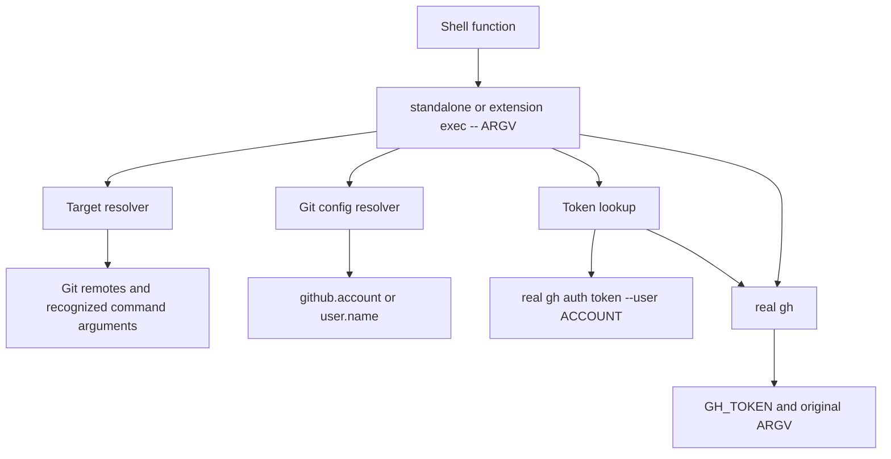

# Architecture and guarantees

This page explains why `gh-auto-switcher` behaves as it does. It is an
explanation document, not a command tutorial. For procedures, use the
[usage guide](usage.md).

[한국어 아키텍처](../ko/architecture.md) · [English README](../../README.md) ·
[한국어 README](../../README.ko.md)

## Design goal

The launcher connects two existing sources of truth:

- Git resolves the account for the current repository and working context.
- GitHub CLI owns authentication and executes the GitHub operation.

The launcher adds only a process-local connection between them. It does not
create a profile database, project binding file, token cache, or global account
switch.



On Unix, the launcher replaces itself with the real `gh` process. This keeps
stdin, stdout, stderr, the current directory, exit status, and signals on the
normal process path.

## Configuration delegation

`src/gitconfig.rs` deliberately does not implement Git's configuration
language. It invokes the installed Git process in the launcher's current
working directory:

```sh
git config --get --null github.account
git config --show-origin --get --null github.account
git config --get --null user.name
git config --show-origin --get --null user.name
git config --get-regexp '^remote\\..*\\.url$'
```

Because the Git child inherits the caller's Git-related environment, Git itself
applies:

- local, global, and system precedence;
- ordinary and nested includes;
- every `includeIf` condition understood by that Git version;
- `GIT_DIR`, `GIT_WORK_TREE`, and related worktree context;
- branch and remote state;
- `GIT_CONFIG_*` command-scope configuration.

The launcher gives special meaning to an explicit `github.account` value. When
that key is absent, a valid `user.name` is considered as an account candidate
only if the same authenticated GitHub CLI profile exists. `user.email` is never
used. Explicit account values must match 1–39 ASCII letters, numbers, or
hyphens so they can safely be passed to `gh auth token --user`.

### Why this is safer than reimplementing `includeIf`

A second implementation of Git's condition language would eventually disagree
with Git over pattern matching, path case, worktrees, or future conditions.
Delegating evaluation keeps the account result aligned with the user's actual
Git installation. The trade-off is that the project must test and document the
Git versions and scopes it relies on; it cannot claim that this wrapper
supports every Git behavior independently of Git.

## Credential lifecycle

For an ordinary command, the launcher follows this path:

1. It identifies the target host from a finite set of recognized signals.
2. It rejects conflicting host signals before selecting credentials.
3. It checks whether an explicit caller token applies to that host.
4. If one applies, it leaves the caller environment intact and does not
   retrieve a configured account's token. This takes precedence over account
   validation errors; Git may still be invoked to establish the routing context.
5. Otherwise, it reads the effective `github.account` value from Git. If that
   key is absent, it reads the effective `user.name` value.
6. A valid `user.name` candidate is checked against the authenticated GitHub CLI
   profiles. No matching profile means the stock path; it is not an account
   error.
7. For an explicit account, or a matching implicit `user.name` account, on an
   unambiguous `github.com` target, it runs the real `gh auth token
   --hostname github.com --user ACCOUNT`.
8. It captures the token privately, removes caller token variables during that
   lookup, and supplies the result only to the child `gh` as `GH_TOKEN`.
9. It never calls `gh auth switch`, changes `hosts.yml`, stores the token, or
   prints the token.

A missing or unmatched `user.name` with no caller token is a deliberate stock
path. The launcher can skip host resolution in that case and invokes the real
`gh` unchanged. An explicit account that cannot provide a token is different:
token lookup fails and there is no fallback to another stored account. A
matching implicit profile that exists but cannot provide its token also fails
clearly rather than switching accounts.

Authentication-management and other control-plane commands (`auth`, `help`,
`version`, `completion`, `config`, and `alias`) bypass account injection and go
to the real `gh`. The `auto-switcher` management commands are handled by the
launcher itself.

## Target host inference

Host checks prevent a token selected for `github.com` from being sent to a
known different host. The resolver considers:

- `--hostname HOST` and `--hostname=HOST`;
- `GH_HOST`;
- host-qualified `GH_REPO` and `-R`/`--repo` values;
- repository references for recognized `repo clone` and `repo view` commands;
- URL targets for recognized `pr merge`, `pr view`, `issue view`, and
  `discussion view` commands;
- hosts extracted from the current repository's Git remotes.

All collected hosts must normalize to the same value. A conflict is an error,
even if an explicit token is present. A single unsupported host may pass
through when its applicable caller token already exists; it is not automatically
mapped to a stored account.

The resolver is intentionally not a full GitHub CLI parser. It does not infer
hosts from arbitrary extension commands, aliases, API payloads, or unqualified
repository names. For example, a PR body containing a URL is not treated as a
target. Command-specific value options such as `--body`, `--body-file`, and
`pr view -b` are handled so their values are not mistaken for host signals.

## Shell boundary

The shell hook is deliberately small and works with either installation mode:

```sh
gh() {
    if command -v gh-auto-switcher >/dev/null 2>&1; then
        command gh-auto-switcher exec -- "$@"
    else
        command gh auto-switcher exec -- "$@"
    fi
}
```

Fish uses the equivalent `$argv` form. The hook prefers a standalone executable
when one is on `PATH`; otherwise it re-enters the installed GitHub CLI extension.
The hook does not intercept `cd`, edit `PWD`, export tokens, or modify startup
files. The launcher discovers the real `gh` from `PATH` at invocation time and
excludes its own path. An explicit `GH_AUTO_SWITCHER_REAL_GH` is available for
unusual installations.

This means an absolute invocation such as `/opt/homebrew/bin/gh pr list`, a
script that has not sourced the hook, or another shell function that calls
`gh` directly can bypass the launcher by design.

## Failure and safety boundaries

The implementation prefers a clear failure to a guessed account or host:

- invalid or empty explicit `github.account` values fail;
- an explicit account with no stored token fails without fallback;
- a valid `user.name` without a matching profile preserves stock `gh`;
- a matching implicit profile that cannot provide a token fails without fallback;
- conflicting host signals fail before token injection;
- automatic routing for unsupported Enterprise hosts fails unless an applicable
  explicit caller token is already present;
- missing account configuration and no caller token preserve stock `gh`;
- a missing, non-executable, or self-referential real `gh` path fails;
- token lookup output is not forwarded to the launcher terminal.

The project does not promise that all GitHub CLI commands are understood by the
host resolver. Users of extensions or custom aliases should provide an
applicable explicit token or call the real `gh` directly when the target cannot
be represented by the recognized signals.

## Verified behavior

The current suite contains 5 unit tests and 44 integration tests. Integration
tests use the real local Git executable, isolated temporary Git configuration,
fake `gh` executables, and actual Bash, Zsh, and Fish processes. They cover:

- conditional Git configuration (`gitdir`, `gitdir/i`, `onbranch`, and
  `hasconfig:remote.*.url`);
- nested includes, local/global/command-scope precedence, linked worktrees,
  branch and remote changes without `cd`, and inherited `GIT_CONFIG_*` values;
- explicit and implicit account selection, matching GitHub CLI profiles,
  invalid display names, missing profiles, and malformed explicit configuration;
- explicit token precedence, token isolation, host conflicts, unsupported hosts,
  and target-parser payload boundaries;
- argument quoting and non-UTF-8 arguments, stdin, exit status, signals,
  self-recursion, executable permissions, prebuilt extension hooks, and
  concurrent invocations.

These tests provide evidence for the listed behavior on the tested toolchain;
they are not proof that every Git version, shell implementation, or GitHub CLI
extension has been exhaustively modeled.

## Documentation approach and sources

The repository keeps the README focused on purpose, prerequisites, and first
run. Operational instructions live in the usage guide; design rationale and
guarantees live here. This separation follows:

- [GitHub: About README files](https://docs.github.com/en/repositories/managing-your-repositorys-settings-and-features/customizing-your-repository/about-readmes)
- [GitHub: Setting contribution guidelines](https://docs.github.com/en/communities/setting-up-your-project-for-healthy-contributions/setting-guidelines-for-repository-contributors)
- [Diátaxis: Start here](https://diataxis.fr/start-here/)
