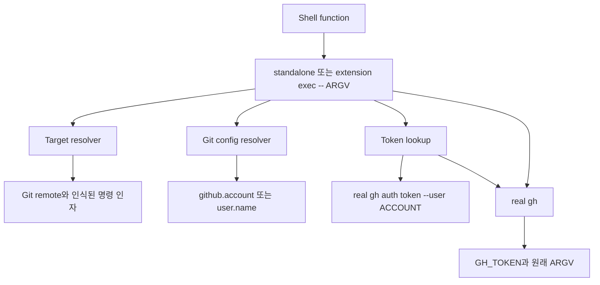

# 아키텍처와 보장 범위

이 문서는 `gh-auto-switcher`가 왜 그렇게 동작하는지 설명합니다. 명령을
따라 하는 방법은 [사용법 문서](usage.md)를 참고하세요.

[English architecture](../en/architecture.md) · [English README](../../README.md) ·
[한국어 README](../../README.ko.md)

## 설계 목표

launcher는 이미 존재하는 두 source of truth를 연결합니다.

- Git은 현재 repository와 working context에 적용되는 account를 결정합니다.
- GitHub CLI는 authentication을 소유하고 실제 GitHub 작업을 실행합니다.

launcher는 둘 사이를 프로세스 단위로만 연결합니다. 별도의 profile database,
repository binding file, token cache, 전역 account switch를 만들지 않습니다.



Unix에서는 launcher가 실제 `gh` 프로세스로 자신을 대체합니다. 따라서 stdin,
stdout, stderr, 현재 디렉터리, exit status, signal이 일반적인 프로세스 경로를
그대로 따릅니다.

## Git 설정 위임

`src/gitconfig.rs`는 Git 설정 언어를 구현하지 않습니다. launcher의 현재
working directory에서 설치된 Git을 실행합니다.

```sh
git config --get --null github.account
git config --show-origin --get --null github.account
git config --get --null user.name
git config --show-origin --get --null user.name
git config --get-regexp '^remote\..*\.url$'
```

Git subprocess는 호출자의 Git 관련 환경을 상속하므로 Git이 다음을 직접
적용합니다.

- local, global, system 우선순위;
- 일반 include와 중첩 include;
- 해당 Git 버전이 이해하는 모든 `includeIf` 조건;
- `GIT_DIR`, `GIT_WORK_TREE` 및 worktree context;
- branch와 remote 상태;
- `GIT_CONFIG_*` command-scope 설정.

launcher가 특별한 의미를 부여하는 것은 명시적인 `github.account` 값입니다.
이 key가 없으면 유효한 `user.name`을 account 후보로 보고, GitHub CLI 설정에
`github.com`용으로 저장된 동일한 profile 이름이 있을 때만 사용합니다. profile
이름 조회는 `hosts.yml`을 읽으며 `gh auth status`를 실행하거나 token을 검증하지
않습니다. `user.email`은 사용하지 않습니다. 명시 account 값은 `gh auth token
--user`에 안전하게 전달할 수 있도록 ASCII 문자·숫자·하이픈으로 구성된
1–39자여야 합니다.

### `includeIf`를 다시 구현하지 않는 이유

Git condition 언어를 두 번째로 구현하면 pattern matching, path 대소문자,
worktree, 향후 condition에서 Git과 결과가 달라질 수 있습니다. Git에 위임하면
사용자의 실제 Git 설치가 계산한 account 결과와 일치합니다. 대신 이 프로젝트는
사용하는 Git 버전과 scope를 문서화하고 테스트해야 하며, Git과 무관하게 모든
Git 동작을 지원한다고 주장하지 않습니다.

## Credential lifecycle

일반 명령은 다음 흐름으로 처리됩니다.

1. 제한된 host 신호 집합에서 target host를 확인합니다.
2. credential을 선택하기 전에 서로 다른 host 신호를 거부합니다.
3. 해당 host에 적용되는 caller token이 있는지 확인합니다.
4. token이 있으면 caller 환경을 그대로 두고 configured account의 token을 조회하지
   않습니다. account validation error도 이 경우에는 노출하지 않습니다. routing
   context를 확인하기 위해 Git은 여전히 실행될 수 있습니다.
5. 그렇지 않으면 Git에서 최종 `github.account`를 읽습니다. 이 key가 없으면
   최종 `user.name`을 읽습니다.
6. 유효한 `user.name` 후보는 `github.com`용으로 저장된 GitHub CLI profile 이름과
   비교합니다. 일치하는 profile이 없으면 account 오류가 아니라 stock 경로를
   사용합니다. 이 metadata 조회는 credential을 검증하지 않습니다.
7. 명시 account 또는 일치한 implicit `user.name` account가 있고 target이
   충돌 없는 `github.com`이면 실제 `gh auth token --hostname github.com
   --user ACCOUNT`를 실행합니다.
8. token을 비공개로 캡처하고 token 조회 중 caller token 변수를 제거한 뒤, 결과를
   자식 `gh`의 `GH_TOKEN`으로만 전달합니다.
9. `gh auth switch`를 호출하거나 `hosts.yml`을 바꾸거나 token을 저장·출력하지
   않습니다.

일치하는 `user.name` profile이 없고 caller token도 없으면 의도적인 stock 경로입니다.
이 경우 launcher는 host를 임의로 만들지 않고 host 확인을 생략할 수 있으며 실제
`gh`를 변경 없이 실행합니다. 반대로 명시 account가 token을 제공하지 못하면 token
조회가 실패하며 다른 account로 fallback하지 않습니다. 일치하는 implicit profile이
존재하지만 token을 제공하지 못하는 경우도 명확히 실패합니다.

`auth`, `help`, `version`, `completion`, `config`, `alias` 같은 control-plane
명령은 account token 주입을 건너뛰고 실제 `gh`로 전달합니다.
`auto-switcher` 관리 명령은 launcher가 직접 처리합니다.

## Target host 추론

host 검사는 `github.com`용으로 선택한 token을 알고 있는 다른 host에 보내지 않도록
합니다. resolver는 다음을 확인합니다.

- `--hostname HOST`, `--hostname=HOST`;
- `GH_HOST`;
- host-qualified `GH_REPO`와 `-R`/`--repo` 값;
- 인식된 `repo clone`, `repo view`의 repository reference;
- 인식된 `pr merge`, `pr view`, `issue view`, `discussion view`의 URL target;
- 현재 repository Git remote에서 추출한 host.

수집된 host는 모두 같은 값으로 normalize되어야 합니다. 충돌은 explicit token이
있어도 오류입니다. 하나의 unsupported host는 해당 host에 적용되는 caller token이
이미 있을 때에만 그대로 통과하며, 저장 account에 자동 매핑하지 않습니다.

resolver는 완전한 GitHub CLI parser가 아닙니다. 임의의 extension 명령, alias,
API payload, host가 없는 repository 이름에서 host를 추론하지 않습니다. 예를
들어 PR body의 URL은 target으로 처리하지 않습니다. `--body`, `--body-file`,
`pr view -b` 같은 command-specific value option은 값이 host 신호로 오인되지
않도록 구분합니다.

## Shell 경계

shell hook은 두 설치 방식에서 사용할 수 있도록 의도적으로 작습니다.

```sh
gh() {
    if command -v gh-auto-switcher >/dev/null 2>&1; then
        command gh-auto-switcher exec -- "$@"
    else
        command gh auto-switcher exec -- "$@"
    fi
}
```

Fish에서는 이에 해당하는 `$argv` 형식을 사용합니다. hook은 `PATH`에 standalone
실행 파일이 있으면 우선 사용하고, 없으면 설치된 GitHub CLI extension으로
다시 진입합니다. `cd`를 가로채거나 `PWD`를 수정하거나 token을 export하거나
startup 파일을 변경하지 않습니다. launcher는 실행될 때마다 `PATH`에서 자기
자신의 경로를 제외한 실제 `gh`를 찾습니다. 특수한 설치에서는
`GH_AUTO_SWITCHER_REAL_GH`를 지정할 수 있습니다.

따라서 `/opt/homebrew/bin/gh pr list` 같은 절대 경로, hook을 source하지 않은
script, 다른 shell function이 직접 부르는 `gh`는 의도적으로 launcher를 우회할
수 있습니다.

## 실패와 안전 경계

구현은 account나 host를 추측하기보다 명확히 실패합니다.

- 비어 있거나 잘못된 명시 `github.account`는 실패합니다.
- token이 없는 명시 account는 실패하며 fallback하지 않습니다.
- host 신호 충돌은 token 주입 전에 실패합니다.
- unsupported Enterprise host의 자동 routing은 해당 host용 explicit caller token이
  이미 있을 때를 제외하고 실패합니다.
- 선택 가능한 account가 없고 caller token도 없으면 stock `gh`를 유지합니다.
- 유효한 `user.name`과 일치하는 profile이 없으면 stock `gh`를 유지합니다.
- 일치하는 implicit profile이 token을 제공하지 못하면 fallback하지 않고 실패합니다.
- 실제 `gh` 경로가 없거나 실행 권한이 없거나 launcher 자신을 가리키면 실패합니다.
- token lookup 출력은 launcher terminal로 전달되지 않습니다.

모든 GitHub CLI 명령을 host resolver가 이해한다고 약속하지 않습니다. extension이나
custom alias를 사용하는 경우 target을 인식된 신호로 표현할 수 없다면 적용 가능한
explicit token을 제공하거나 실제 `gh`를 직접 호출하세요.

## 검증된 동작

현재 suite는 unit test 5개와 integration test 44개로 구성됩니다. integration
test는 실제 local Git 실행 파일, 격리된 임시 Git 설정, 가짜 `gh` 실행 파일, 실제
Bash/Zsh/Fish 프로세스를 사용합니다. 다음을 검증합니다.

- conditional Git 설정인 `gitdir`, `gitdir/i`, `onbranch`,
  `hasconfig:remote.*.url`;
- 중첩 include, local/global/command-scope 우선순위, linked worktree, `cd` 없는
  branch·remote 변경, 상속된 `GIT_CONFIG_*` 값;
- 명시·implicit account 선택, matching GitHub CLI profile, 잘못된 표시 이름,
  누락 profile, 잘못된 account 설정;
- explicit token 우선순위, token 격리, host 충돌, unsupported host, target parser의
  payload 경계;
- 인자 quoting과 non-UTF-8 인자, stdin, exit status, signal, self-recursion,
  실행 권한, prebuilt extension hook, 동시 실행.

이 테스트는 검증된 toolchain에서 위 동작을 뒷받침하는 증거이지, 모든 Git 버전,
shell 구현, GitHub CLI extension을 완전히 모델링했다는 증명은 아닙니다.

## 문서 구조와 참고 자료

README는 목적, 사전 요구사항, 첫 실행에 집중합니다. 실제 운영 절차는 사용법
문서에, 설계 이유와 보장 범위는 이 문서에 둡니다. 다음 원칙을 적용했습니다.

- [GitHub: README 안내](https://docs.github.com/en/repositories/managing-your-repositorys-settings-and-features/customizing-your-repository/about-readmes)
- [GitHub: 기여 안내](https://docs.github.com/en/communities/setting-up-your-project-for-healthy-contributions/setting-guidelines-for-repository-contributors)
- [Diátaxis: 시작하기](https://diataxis.fr/start-here/)
